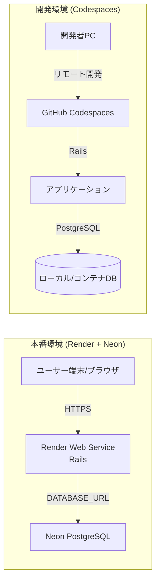

# サービス名：StepLog

> ※ 本 README は **開発前の設計用 README** です。
> 実装の進行にあわせて随時更新します。
URLは上の方に貼り付ける

---

## サービス概要

StepLog は、習慣化に何度も失敗してきた人や、完璧主義で挫折しがちな人を対象とした習慣管理アプリです。
「毎日続けなければならない」というプレッシャーによって、行動できなかった日を失敗と捉え、習慣そのものをやめてしまう課題に着目しました。
毎日継続を前提とせず、できた日だけを記録することで、行動をゼロにしない状態をつくることを目的としています。

---

## コンセプト

StepLog のコンセプトは、行動を継続させることではなく、「再開できる状態」をつくることです。
継続できないことを失敗として扱わず、少しでも行動した事実を肯定する設計を大切にしています。
習慣化アプリで何度も挫折した経験があり、連続記録やカレンダーの空白にストレスを感じやすい人を想定ユーザーとしています。

---

## 開発背景

私はこれまで、「毎日やらなければならない」という意識が行動の負担となり、継続できなかった経験を何度もしてきました。
できなかった日は自己否定につながり、結果として習慣そのものをやめてしまうことが多くありました。

一方で、完璧を求めずに行動を積み重ねたときには、週に数日の食事改善による減量や、無理のない学習による理解度の向上など、少しずつ変化が生まれることも実感しました。
毎日実行できていなくても、心理的なハードルが下がり、自然に取り組める状態に近づいていれば、それは習慣化の途中だと考えるようになりました。

しかし、多くの習慣管理アプリは「毎日継続すること」を前提としており、できない人ほど挫折しやすい構造になっています。
そこで StepLog では、継続できないことを前提にし、行動をゼロにしない状態をつくることを目的とした設計を採用しました。

---

## 主な機能（予定）

※ 実装内容は開発過程で変更する可能性があります

| 機能           | 内容                             | 設計意図                                                 |
| -------------- | -------------------------------- | -------------------------------------------------------- |
| 習慣登録       | 習慣は1つだけ登録可能            | 習慣を絞ることで「やることが多すぎて挫折する」状態を防ぐ |
| 行動記録       | 1日1回、3択で行動を記録          | 完璧にできなくても記録できる設計にし、自己否定を減らす   |
| 行動履歴表示   | 過去の行動履歴を一覧で確認可能   | 振り返りやすくし、小さな積み重ねを実感できるようにする   |
| 累計日数表示   | 行動した累計日数を表示           | 連続日数に縛られず、継続の事実だけを評価する             |
| 肯定メッセージ | 行動後に肯定的なメッセージを表示 | 行動できた事実を認め、モチベーション低下を防ぐ           |
| ログイン不要   | ブラウザ単位で利用可能           | 登録の手間をなくし、すぐに使い始められるようにする       |

※ 完璧主義の人が挫折しやすい「連続記録の途切れ」や「カレンダーの空欄」によるストレスを避けるため、初期リリースではストリーク機能やカレンダー表示は実装しない方針としています。

---

## 技術選定（更新版）

※ 実装状況や完成度を優先し、必要に応じて段階的に拡張する。

### バージョン情報

- **Ruby**: 3.4.1
- **Ruby on Rails**: 7.2.2
- **Database**: PostgreSQL 16
- **Docker**: 28.5.1
- **Environment**: GitHub Codespaces (Dev Containers)

---

## 全体方針

- 本アプリは **エンジニア転職用ポートフォリオ**として、
  新技術の採用数よりも **仕様・設計意図と実装の一貫性**、
  そして **最後まで完成・公開すること**を最優先とする。
- 初期構成は **Railsモノリス**（フロントエンドとバックエンドを1つのRailsアプリで構成）とし、
  不要な複雑化（CORS / CSRF / 認証設計）を避ける。

---

## フロントエンド（画面）

- **使用技術**：HTML（Rails View / ERB） / Tailwind CSS / JavaScript（Stimulus）

### 選定理由

HTMLを基盤とし、画面構造を明確に保ったままUIを構築するため。
RailsのViewを利用することで、フロントエンドとバックエンドを分離せずに実装でき、
開発・デプロイの難易度を抑えつつ、仕様と画面の対応関係を分かりやすく保てると考えた。

Tailwind CSSは、クラス設計を通してUIの意図がコード上で把握しやすく、
実装とデザインの対応関係を明確にできる点を評価して採用。

JavaScriptは、フォーム入力補助や二重送信防止など、
UIの複雑化しやすい箇所に限定して利用する方針とする。
Rails標準のStimulusを使い、最小限の記述で動作を追加できる構成を重視する。

---

## バックエンド

- **使用技術**：Ruby / Ruby on Rails

### 選定理由

CRUD機能を少ないコード量で実装でき、仕様変更にも柔軟に対応できるため。
また、「1ユーザーにつき1習慣」「1日1記録」といった制約のある業務ロジックを、
モデル・バリデーション・マイグレーションとして明確に表現しやすく、
仕様とコードの対応関係を保った設計がしやすいと考えた。

---

## データベース

- **使用技術**：PostgreSQL

### 選定理由

Railsとの親和性が高く、
UNIQUE制約や外部キー制約をデータベースレベルで定義できるため採用。
アプリケーション側の実装だけに依存せず、
データの整合性を構造として担保する設計を重視している。

---

## 認証・ユーザー管理

- **使用技術**：Rails session（Cookie） / LocalStorage（必要な場合のみ）

### 選定理由

ログイン機能は実装せず、初回アクセスからすぐに利用できる体験を提供するため。
初期構成ではユーザー管理をサーバー側で持たず、
状態管理は最小限に留める方針とした。

Railsモノリス構成とすることで、
別ドメイン運用に伴うCookie制約やCORS設定を回避し、
シンプルな状態管理を可能にしている。

---

## 開発環境

- **使用技術**：GitHub Codespaces（devcontainer） / CodeX（補助）

### 選定理由

GitHub Codespaces（devcontainer）を利用することで、
開発環境の差分を抑え、第三者が同一手順で再現可能な環境を用意する。
CodeXは初期セットアップや定型作業の補助として利用し、
最終的な構成判断や手順はREADMEおよびIssueに明文化する。

---

### 開発環境構築手順（STEP 1〜8）

1. **GitHubリポジトリ作成**: README込みでリポジトリを新規作成。
2. **Codespaces起動**: クラウド上の開発コンテナを立ち上げ。
3. **Rails初期化**: `gem install rails` および `rails new . --database=postgresql`。
4. **Docker設定**: `.devcontainer` 内に環境定義ファイルを配置。
5. **リビルド**: 設定を適用し、Dockerコンテナ内での開発環境を確立。
6. **DB/コマンド設定**: `database.yml` 修正と `bin/setup`, `bin/dev` の作成。
7. **動作確認**: `bin/setup` 実行後、Railsの初期画面表示を確認。
8. **ブランチ運用開始**: `main` を保存し、 `develop` ブランチでの開発フェーズへ移行。

---

## デプロイ・実行環境

- **使用技術（初期）**：Ruby on Rails（フロント・バックエンド一体） / PostgreSQL

### 選定理由

構成を単純化し、デプロイおよび運用時の失敗要因を減らすことで、
確実にサービスを完成・公開することを優先するため。

### 将来的な拡張

UIの複雑化や要件変更が発生した場合には、
フロントエンド分離（Vercel）やAPI化を段階的に検討する。
ただし初期段階では導入せず、完成度を優先する。

本アプリでは、新しい技術を多く採用することよりも、
課題設定と設計意図を明確にし、
サービスを最後まで完成・公開することを最重要視する。

---

## インフラ構成図（本番・開発）



---

## 設計上の制約・方針

本サービスでは、「行動を止めない体験」を実現するために、
あえて機能や選択肢を増やしすぎない設計方針を採用しています。

まず、本サービスはWebサービスとして提供し、
スマートフォンアプリ（iOS / Android）は対象外としています。
これは、インストールや初期設定といった手間を排除し、
初回アクセスからすぐに使える体験を優先するためです。

また、ログイン機能（メールアドレス・パスワード認証）は実装していません。
ユーザーの識別はブラウザ単位（Cookie / LocalStorage）で行い、
入力負担や心理的ハードルを極力下げる設計としています。
ユーザーの行動記録は、他の利用者から閲覧できないよう配慮しています。

登録できる習慣は1つのみに制限しています。
複数の習慣を同時に管理することで挫折しやすくなることを避け、
「まずは1つの行動をゼロにしない」ことに集中できる構造を目指しました。

通知機能（プッシュ通知・メール通知）は初期リリースでは実装していません。
通知によるプレッシャーや義務感が、
かえって行動を止める要因になると考えたためです。

UI・デザインについては、装飾を抑え、
シンプルさと可読性を最優先としています。
操作は直感的で、記録完了までの操作数を最小限にし、
表示や動作の軽快さを重視しています。

これらの制約はすべて、
「毎日使えなくても成立する」「失敗感を与えない」
というコンセプトを実現するための、意図的な設計判断です。

---

## 設計資料（実装後調整　作成予定）

- ER図

  ```mermaid
  erDiagram
  USERS {
    bigint id PK
    string session_token "NOT NULL, UNIQUE"
    datetime created_at "NOT NULL"
    datetime updated_at "NOT NULL"
  }

  HABITS {
    bigint id PK
    bigint user_id FK "NOT NULL, INDEX, UNIQUE(user_id)"
    string name "NOT NULL"
    datetime created_at "NOT NULL"
    datetime updated_at "NOT NULL"
  }

  HABIT_LOGS {
    bigint id PK
    bigint user_id FK "NOT NULL, INDEX"
    string name
    string event
    datetime created_at "NOT NULL"
    datetime updated_at "NOT NULL"
  }

  RECORDS {
    bigint id PK
    bigint user_id FK "NOT NULL, INDEX"
    date recorded_on "NOT NULL"
    int result "NOT NULL, DEFAULT 0"
    datetime created_at "NOT NULL"
    datetime updated_at "NOT NULL"
    string unique_user_date "UNIQUE(user_id, recorded_on)"
  }

  USERS ||--o| HABITS : has
  USERS ||--o{ HABIT_LOGS : has
  USERS ||--o{ RECORDS : has
  ```

````

- 画面遷移図

  ```mermaid
flowchart LR
  TP[トップページ]:::top --> Q{習慣登録済？}

  Q -- No --> REG[習慣登録画面]
  REG -- 登録 --> MAIN[メイン画面]:::main

  Q -- Yes --> MAIN

  MAIN -- 履歴 --> HIS[履歴一覧]
  HIS -- 戻る --> MAIN

  MAIN -- 編集 --> EDIT[習慣編集画面]
  EDIT -- 更新 --> MAIN
  EDIT -- キャンセル --> MAIN
  EDIT -- 削除 --> MAIN

  MAIN -- 記録 --> REC[記録処理<br/>records#create]
  REC -- 戻る --> MAIN

  classDef top fill:#BFEFCC,stroke:#222,color:#000,stroke-width:1px;
  classDef main fill:#3DD6E6,stroke:#222,color:#000,stroke-width:1px;

````

---

## 実装後に追記予定

- 苦労した点
- 工夫した点
- こだわった実装
- UI / UX に関する考慮

---

## 今後の開発予定（実装後に記載）

-
-

---

## サービスURL

-

---

## 関連記事

- Qiita（予定）
