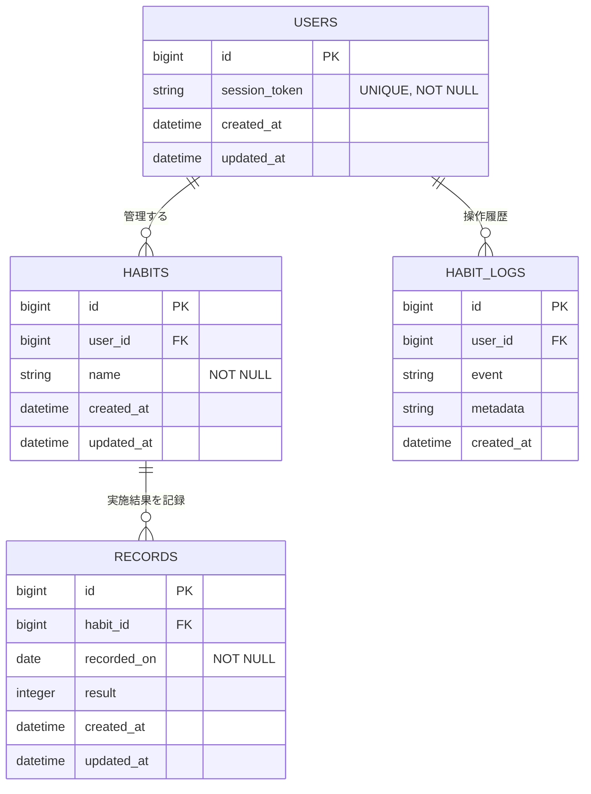
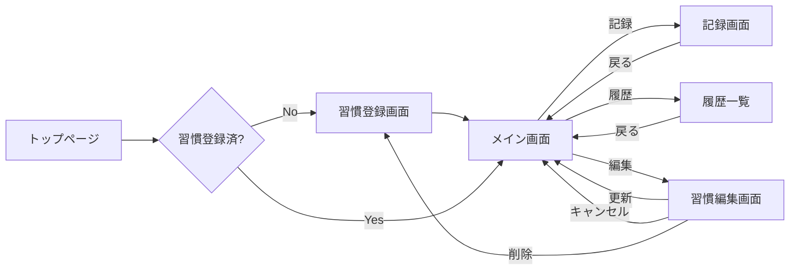

# Step Log

### **毎日できなくてもいい。行動をゼロにしないための習慣管理アプリ**

- **サービスURL:** https://step-log.onrender.com/
- **Qiita記事:** [URLを貼る]

---

## 🎥 デモ動画 / GIF

---

## 🚀 サービス概要（30秒でわかるStep Log）
- **解決したい課題:** 「毎日やらなければ」という完璧主義による挫折と自己否定。
- **提供価値:** 連続記録が途切れても罪悪感なく「再開できる」状態をつくる。
- **技術の見どころ:** Rails 7.2最新環境 / Dockerによる再現性 / DB制約による徹底したデータ整合性。

---

## 📋 目次

クリックで開く

- [🎯 コンセプト・開発背景](#-コンセプト開発背景)
- [📝 機能一覧](#-機能一覧)
- [✨ こだわり・工夫・苦労した点](#-こだわり工夫苦労した点)
- [🛠 使用技術・選定理由](#-使用技術選定理由)
- [⚙️ 開発環境・構築手順](#️-開発環境構築手順)
- [📊 設計資料](#-設計資料)
- [🚀 今後の展望](#-今後の展望)

---

## 🎯 コンセプト・開発背景
### **「毎日」という呪縛を解き、「再開」をデザインする**
習慣化において最大の敵は、一度の挫折で「自分はダメだ」と投げ出してしまう完璧主義による自己否定です。
Step Logは、習慣を「継続させること」ではなく、途切しても**「何度でも再開できる状態」**をつくることを最優先に設計した習慣管理アプリです。

#### **開発の原体験**
私自身、かつては「毎日やらなければならない」という強迫観念が行動の重荷となり、継続できなかった日は激しい自己否定に陥り、習慣そのものをやめてしまう経験を繰り返してきました。
転機となったのは、完璧主義を捨て「行動をゼロにしないこと」を意識したことです。たとえ毎日でなくても、無理のないペースで積み重ねることで、以下のような成果を得ることができました。

- **食事改善:** 「週に数日」から始め、4ヶ月で5kgの減量に成功。
- **資格学習:** 基本情報技術者試験の過去問正解率を、約3割から6割以上へ向上。

この経験から、**「毎日実行できていなくても、取り組む心理的障壁が下がり、自然に再開できる状態に近づいていれば、それは習慣化のプロセスである」**と確信しました。

#### **なぜこのアプリが必要なのか**
既存の習慣管理アプリの多くは、連続記録（ストリーク）を重視しています。しかし、これは挫折した人にとっては再開を躊躇させるストレス要因（負の遺産）になってしまいます。
Step Logは、あえて「連続性」を評価の軸から外しました。

- **記録がない日を「失敗」と見なさない**
- **できた日だけをシンプルに肯定する**

このような「低ハードルな設計」にすることで、完璧主義による挫折を防ぎ、ユーザーが何度でも行動を積み直せる体験を提供します。

---

## 📝 機能一覧
あえて機能を絞り込む「引き算の設計」を採用しています。

### **1. メイン機能（習慣管理）**
- **習慣の1件集中登録**
  複数の習慣を並行して挫折するのを防ぐため、あえて1件のみに限定。選択と集中を促します。
- **3段階の行動記録（できた / 少しだけ / お休み）**
  「低空飛行の継続」を肯定するための3択制。体調に合わせた柔軟な記録が可能です。
- **1日1記録のデータ整合性**
  DBレベルでの複合ユニーク制約（ユーザー×日付）により、二重登録を物理的に防止します。
- **柔軟な記録の更新・上書き**
  その日のうちであれば何度でも記録を変更可能。心理的ストレスを排除しています。

### **2. ダッシュボード・可視化**
- **積み上げサマリ表示**
  「累計日数」をトップに表示。連続記録が途切れても努力が消えないことを強調します。
- **直近7件のクイック履歴**
  ホーム画面で直近の頑張りを即座に確認し、自己肯定感を高めます。
- **全件履歴ページ**
  過去の全ての行動を日付順に表示し、長期的な変化を俯瞰できます。

### **3. UX・共通機能**
- **かんたん体験（疑似ログイン）**
  ポートフォリオとしての閲覧性を優先し、ログイン不要ですぐに全機能が使える設計です。
- **ダークモード切替**
  Local Storageを活用してモードを保持。夜間の記録でも目に優しいUIを選択できます。
- **Markdownベースの静的ページ**
  利用規約等をMarkdownで一元管理。メンテナンス性と読みやすさを両立しました。
- **変更ログの自動保存**
  習慣名の変更や削除履歴を内部保持し、将来的な分析機能を見据えたデータ構造にしています。

---

## ✨ こだわり・工夫・苦労した点 

### **✨ こだわり：完璧主義を崩すための「あえて」の設計判断**
- **「1ユーザー1習慣」を構造で表現**
  ルーティングに `resource :habit`（単数形）を採用し、DBレベルでもユニーク制約を付与。「まずは一つを大切にする」思想をシステム全体で強制しました。
- **「お休み」を肯定し、積み上げを可視化**
  記録時に「お休み」を選択しても肯定的なメッセージを表示。累計日数からは自動除外することで、連続記録のストレスを「純粋な努力の積み上げ」へと転換しました。
- **Markdownによる運用重視の規約管理**
  `Redcarpet` を導入。法改正等の際もコードを大きく触らずドキュメント更新が可能な柔軟性を確保しました。

### **💡 工夫：信頼性を担保するテストとCIの導入**
- **CI（GitHub Actions）による自動検証**
  push時に RSpec が自動実行される環境を構築。デグレを未然に防ぎ、常に動作が保証されたコードを維持しています。
- **「未来に落ちない」テスト設計**
  `ActiveSupport::Testing::TimeHelpers` を活用。実行時刻を固定することで、いつ実行しても正しく動作する堅牢なテストを記述しています。

### **🛠 苦労：環境構築とデバッグのプロセス**
- **開発環境の移行（Codespacesの採用）**
  Windows特有の環境問題を、GitHub Codespaces の導入によりOSに依存しない再現性の高い開発環境を実現し解決しました。
- **DB整合性の徹底（複合ユニーク制約）**
  「1日1記録」を守るため、Rails側のバリデーションに加えDBレベルで複合一意性制約（`habit_id` × `recorded_on`）を設定。データの重複を物理的に不可能にしました。

---

## 🛠 使用技術・選定理由
「シンプルで堅牢なアプリ」を目指して以下の技術を採用しました。

### **1. メインの技術**
- **Ruby 3.4.7 / Ruby on Rails 7.2.3**
  - 選定理由: 開発スピードが速く、一人でアプリ全体を把握しながら作るのに適しているため。最新の機能を積極的に取り入れています。
- **Tailwind CSS 4.0**
  - 選定理由: HTML上で直接デザインの微調整ができ、迅速に見た目を整えることができるため。

### **2. データの管理（データベース）**
- **PostgreSQL 16**
  - 選定理由: データの整合性を保つ機能が充実しており、DB側での制約設定によって不整合なログが入り込むのを防げるため。

### **3. 品質の管理（テストと整理）**
- **RSpec**
  - 選定理由: 機能追加時に既存機能が壊れていないか自動チェックし、安心感を持って開発を進めるため。
- **RuboCop / Brakeman**
  - 選定理由: コードスタイルの統一とセキュリティの穴を自動チェックし、一人では気づきにくいミスを防ぐため。

### **4. 開発の土台（環境）**
- **Docker / GitHub Codespaces**
  - 選定理由: どんな端末でも同じ状態で開発を再開でき、環境構築ではなくコードを書く時間に集中するため。
- **Render / Neon PostgreSQL**
  - 選定理由: 設定の手間を最小限に抑え、スムーズにインターネットへ公開できる構成として想定。

---

## ⚙️ 開発環境・構築手順

### GitHub / Codespaces
本プロジェクトは **GitHub Codespaces（Dev Containers）** を利用しています。  
ブラウザさえあれば、ローカル環境構築なしで、すぐに開発・動作確認が可能です。

### 開発環境のスペック

- **コンテナ構成**
  - Ruby 3.3
  - Node.js 20
  - PostgreSQL 16

- **起動ツール**
  - foreman  
    （Rails と Tailwind CSS を同時に起動するためのツール）
    
## セットアップ手順

### 1. リポジトリを Codespaces で開く
GitHub の **「Code」ボタン**から **「Codespaces」タブ**を選び、  
**「Create codespace on main」** をクリックして起動します。  

※ コンテナの起動が完了するまで数分待ちます。

### 2. 初期セットアップを実行
ターミナルで以下のコマンドを入力し、  
必要なライブラリのインストールとデータベースの準備を行います。

bin/setup

### 3. 開発サーバーを起動
セットアップ完了後、以下のコマンドでサーバーを起動します。

bin/dev

### 4. ブラウザで確認
サーバーが起動すると、右下に 「ブラウザで開く」 というポップアップが表示されるので、それをクリックします。

手動で開く場合は、以下の URL にアクセスしてください。

http://localhost:3000

---

## 📊 設計資料

### ER図

---

### 画面遷移図

---

### 画面一覧

各画面のプレビューと主な機能の一覧です。

|  |  |
| :--- | :--- |
| **トップページ** | **メイン画面** |
|||
| **習慣登録画面** | **習慣編集画面** |
|||
| **履歴画面** | **ダークモード** |
|||

---

### インフラ構成図

<svg xmlns="http://www.w3.org/2000/svg" viewBox="0 0 1400 900" style="font-family: sans-serif;">
  <!-- Define styles -->
  <defs>
    
    <marker id="arrowhead" markerWidth="10" markerHeight="10" refX="9" refY="3" orient="auto">
      <polygon points="0 0, 10 3, 0 6" fill="#333" />
    </marker>
  </defs>

  <!-- Production Environment -->
  <rect class="subgraph" x="50" y="50" width="600" height="380" rx="5"/>
  <text class="title" x="70" y="80">本番環境 (Render + Neon)</text>
  
  <!-- User Browser -->
  <rect class="box" x="80" y="110" width="180" height="60" rx="3"/>
  <text class="text" x="170" y="135" text-anchor="middle">ユーザー端末/</text>
  <text class="text" x="170" y="155" text-anchor="middle">ブラウザ</text>
  
  <!-- Render Web Service -->
  <rect class="box" x="340" y="110" width="180" height="60" rx="3"/>
  <text class="text" x="430" y="130" text-anchor="middle">Render Web Service</text>
  <text class="text" x="430" y="150" text-anchor="middle">Rails (Puma)</text>
  
  <!-- Neon PostgreSQL -->
  <rect class="box" x="340" y="240" width="180" height="60" rx="3"/>
  <text class="text" x="430" y="265" text-anchor="middle">Neon PostgreSQL</text>
  
  <!-- Render Storage -->
  <rect class="box" x="80" y="240" width="180" height="60" rx="3"/>
  <text class="text" x="170" y="265" text-anchor="middle">Render内ストレージ</text>
  
  <!-- Monitoring -->
  <rect class="box" x="340" y="350" width="180" height="60" rx="3"/>
  <text class="text" x="430" y="370" text-anchor="middle">監視/アラート</text>
  <text class="text" x="430" y="390" text-anchor="middle">(Sentry など)</text>
  
  <!-- Arrows for Production -->
  <!-- User to Render -->
  <path class="arrow" d="M 260 140 L 340 140"/>
  <text class="label" x="280" y="130">HTTPS</text>
  
  <!-- Render to Neon -->
  <path class="arrow" d="M 430 170 L 430 240"/>
  <text class="label" x="440" y="205">DATABASE_URL (TLS)</text>
  
  <!-- Render to Storage -->
  <path class="arrow" d="M 340 150 L 260 260"/>
  <text class="label" x="250" y="190">ActiveStorage</text>
  <text class="label" x="250" y="205">(local)</text>
  
  <!-- Render to Monitoring -->
  <path class="arrow" d="M 430 170 L 430 350"/>
  <text class="label" x="440" y="260">Logs/Errors</text>

  <!-- CI/CD Environment -->
  <rect class="subgraph" x="700" y="50" width="650" height="200" rx="5"/>
  <text class="title" x="720" y="80">CI/CD</text>
  
  <!-- GitHub Repo -->
  <rect class="box" x="730" y="110" width="180" height="60" rx="3"/>
  <text class="text" x="820" y="145" text-anchor="middle">GitHub Repo</text>
  
  <!-- GitHub Actions -->
  <rect class="box" x="980" y="110" width="180" height="60" rx="3"/>
  <text class="text" x="1070" y="130" text-anchor="middle">GitHub Actions</text>
  <text class="text" x="1070" y="150" text-anchor="middle">Tests/Lint</text>
  
  <!-- CI/CD Arrows -->
  <path class="arrow" d="M 910 140 L 980 140"/>
  <text class="label" x="925" y="130">Push/PR</text>
  
  <path class="arrow" d="M 1070 170 Q 1070 250 520 180"/>
  <text class="label" x="800" y="220">Deploy Hook</text>

  <!-- Backup Environment -->
  <rect class="subgraph" x="700" y="300" width="650" height="130" rx="5"/>
  <text class="title" x="720" y="330">バックアップ</text>
  
  <!-- Neon Backup -->
  <rect class="box" x="980" y="350" width="180" height="60" rx="3"/>
  <text class="text" x="1070" y="385" text-anchor="middle">Neon Backup</text>
  
  <!-- Backup Arrow -->
  <path class="arrow" d="M 520 270 Q 750 270 980 380"/>
  <text class="label" x="700" y="260">自動バックアップ/PITR</text>

  <!-- Development Environment -->
  <rect class="subgraph" x="50" y="480" width="600" height="200" rx="5"/>
  <text class="title" x="70" y="510">開発環境 (ローカル/コンテナ)</text>
  
  <!-- Developer Browser -->
  <rect class="box" x="80" y="540" width="180" height="60" rx="3"/>
  <text class="text" x="170" y="565" text-anchor="middle">開発者ブラウザ</text>
  
  <!-- Local Rails -->
  <rect class="box" x="340" y="540" width="180" height="60" rx="3"/>
  <text class="text" x="430" y="560" text-anchor="middle">ローカル Rails</text>
  <text class="text" x="430" y="580" text-anchor="middle">(Puma)</text>
  
  <!-- Local PostgreSQL -->
  <ellipse class="box" cx="170" cy="640" rx="90" ry="30"/>
  <text class="text" x="170" y="645" text-anchor="middle">PostgreSQL</text>
  
  <!-- Development Arrows -->
  <path class="arrow" d="M 260 570 L 340 570"/>
  <text class="label" x="280" y="560">HTTP</text>
  
  <path class="arrow" d="M 340 580 L 260 630"/>
  <text class="label" x="270" y="600">ActiveRecord</text>

  <!-- Legend -->
  <text class="title" x="700" y="500" fill="#4682b4">凡例:</text>
  <rect class="box" x="700" y="520" width="80" height="40" rx="3"/>
  <text class="label" x="740" y="545" text-anchor="middle">コンポーネント</text>
  
  <ellipse class="box" cx="830" cy="540" rx="40" ry="20"/>
  <text class="label" x="830" y="545" text-anchor="middle">DB</text>
  
  <path class="arrow" d="M 900 540 L 980 540"/>
  <text class="label" x="940" y="530" text-anchor="middle">通信</text>
</svg>

---

## 🚀 今後の展望

「**習慣化のハードルを下げ、再開を簡単にする**」という体験をさらに深めるため、  
以下のアップデートを予定しています。

---

### 1. ユーザー体験の向上（UX）

#### PWA（Progressive Web App）への対応
スマートフォンのホーム画面からアプリを 1 タップで起動し、  
ネイティブアプリのような感覚で素早く記録できる体験を目指します。

#### プッシュ通知ではなく「優しいリマインド」
追い込むような通知ではなく、  
ユーザーが設定した「この時間なら再開しやすい」タイミングに合わせた  
通知機能を検討しています。

---

### 2. データの可視化とモチベーション

#### 積み上げの「可視化」機能
現在の累計日数だけでなく、  
月ごとの頑張りをヒートマップ（GitHub の草のような形式）で表示し、  
視覚的に「自分の足跡」として実感できる機能を追加予定です。

#### 習慣の「棚卸し」機能
1 件の習慣がある程度定着した、  
または今の自分には合わないと判断した際に、  
スムーズに次の習慣へ切り替えたり、  
過去の習慣を「殿堂入り」として保存できる仕組みを検討しています。

---

### 3. 技術的な挑戦

#### パフォーマンスの最適化
記録件数が増えても快適に動作するよう、  
クエリの最適化やキャッシュの活用（Redis 等）を学び、  
実装に取り入れていきたいと考えています。

#### テストカバレッジの向上
現在は主要機能に絞っている RSpec テストを拡充し、  
より複雑なケースでも安定して動作する  
堅牢なコードベースを目指します。

